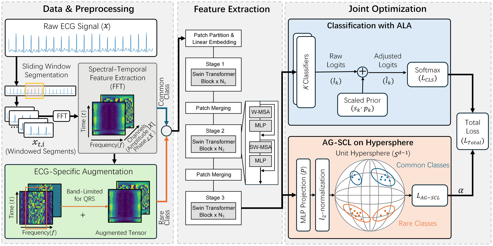
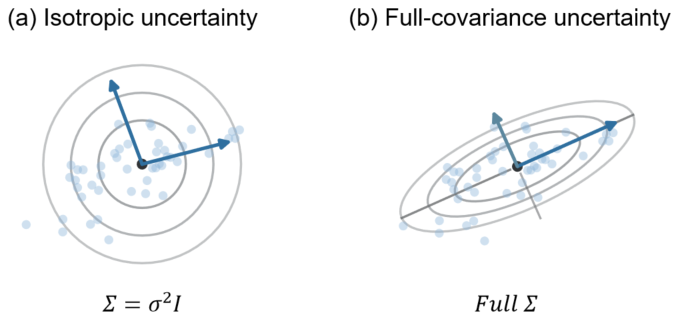
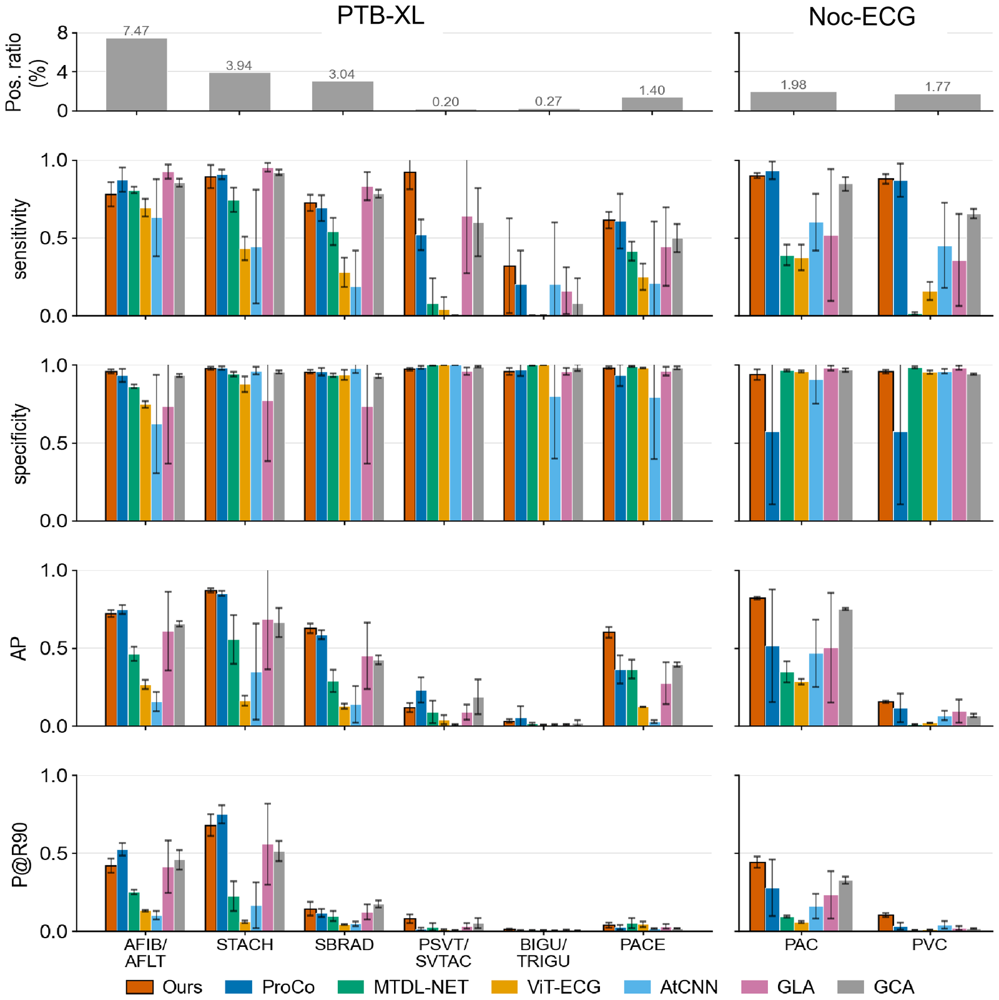

<h1 align="center">Angular Gaussian Supervised Contrastive Learning for Long-Tailed Electrocardiogram Arrhythmia Diagnosis</h1>

This is the official repository to the paper "[Angular Gaussian Supervised Contrastive Learning for Long-Tailed Electrocardiogram Arrhythmia Diagnosis](https://arxiv.org/abs/2607.14613)".

## Overview

AG-SCL addresses label imbalance in multi-label ECG recognition by combining
tail-aware spectral augmentation, direction-dependent class uncertainty, and
learnable prior calibration.

<p align="center">
  <a href="docs/assets/ag-scl-overview.png">
    
  </a>
</p>

<p align="center"><sub><b>AG-SCL overview.</b> Window-wise spectral-temporal views are encoded by a Swin Transformer and jointly optimized with adaptive classification and Angular Gaussian contrastive objectives. Click the figure for the full-resolution version.</sub></p>

| Tail-aware multi-view augmentation                                                             | Angular Gaussian learning                                                            | Adaptive logit adjustment                                                                       |
| :--------------------------------------------------------------------------------------------- | :----------------------------------------------------------------------------------- | :---------------------------------------------------------------------------------------------- |
| Applies stochastic ECG transformations only to records containing at least one positive label. | Models each label state with online full-covariance moments on the unit hypersphere. | Learns bounded label-wise prior scales shared by the classification and contrastive objectives. |

This repository provides the public implementation of the AG-SCL method, model,
augmentations, configuration, tests, and synthetic examples.

## Quick Start

Python 3.10 or later and PyTorch 2.0 or later are required.

```bash
pip install -e .
```

AG-SCL expects a floating-point ECG tensor `[batch, 1, 1000]` and binary
multi-label targets `[batch, num_labels]`. Inputs must already be filtered and
independently Z-score normalized.

```python
from pathlib import Path

import torch
from ag_scl import AGSCL, AGSCLConfig

config = AGSCLConfig.from_yaml(Path("configs/ptbxl_ag_scl.yaml"))
method = AGSCL(config)
optimizer = torch.optim.AdamW(method.parameters(), lr=3e-4, weight_decay=0.02)

for epoch in range(50):
    method.train()
    method.begin_epoch()

    ecg = torch.randn(8, 1, 1000)
    labels = torch.randint(0, 2, (8, 6))
    output = method.training_step(ecg, labels)

    optimizer.zero_grad()
    output.loss.backward()
    torch.nn.utils.clip_grad_norm_(method.parameters(), 5.0)
    optimizer.step()
```

`method.parameters()` includes the encoder, label-specific heads, and learnable
ALA parameters. Call `begin_epoch()` at the start of every epoch to preserve the
online-moment lifecycle used by AG-SCL.

For inference, the model returns unadjusted binary logits for each label:

```python
method.eval()
with torch.no_grad():
    raw_logits = method(ecg)  # [batch, num_labels, 2]
    positive_scores = raw_logits.softmax(-1)[..., 1]
```

Inference uses only the original view. It does not create augmented views,
update class moments, or apply ALA to the returned logits.

## Method

### Spectral-temporal representation and tail-aware views

The public PTB-XL configuration assumes 10-second recordings sampled at 100 Hz.
Each recording is reshaped into 50 contiguous windows of 20 samples, and the FFT
magnitude and phase are retained as two input channels.

A record is augmentation-eligible when any binary label equals one:

```python
eligible = labels.bool().any(dim=1)
```

Training uses one original view and two stochastic views. For each stochastic
view, one transformation is selected uniformly at batch scope; its parameters
and application mask are sampled independently per record. All-zero records
remain unchanged.

| Transformation                     | Application probability |
| ---------------------------------- | ----------------------: |
| Signal negation                    |                     0.1 |
| Global amplitude scaling           |                     0.5 |
| Additive jitter                    |                     0.5 |
| Frequency masking                  |                     0.5 |
| Band-constrained phase jitter      |                     0.5 |
| Band-constrained magnitude scaling |                     0.5 |

The phase and magnitude transforms use `[0.5, 7)`, `[7, 25)`, and `[25, 50)` Hz
bands. Frequency masking preserves the experimental implementation and operates
without a protected 7--25 Hz interval.

### Angular Gaussian scoring

<p align="center">
  <a href="docs/assets/angular-gaussian-geometry.png">
    
  </a>
</p>

<p align="center"><sub><b>Direction-dependent uncertainty.</b> Isotropic dispersion assigns the same uncertainty in every direction, while a full covariance follows class-specific principal axes.</sub></p>

AG-SCL maintains online means and full covariances for every label state. Its
MGF-derived Angular Gaussian score evaluates unit-normalized queries against
these class statistics. Count-based shrinkage stabilizes covariance estimates
when positive examples are scarce, while retaining direction-dependent
uncertainty that an isotropic model cannot express.

### Joint optimization

Each label has an independent binary classification head and a normalized
256-dimensional projection head. The training objective sums the classification
loss and the two-view Angular Gaussian supervised contrastive loss. Adaptive
Logit Adjustment (ALA) learns bounded label-wise scales for configured class
priors and participates in both objectives.

## Results

<p align="center">
  <a href="docs/assets/per-class-results.png">
    
  </a>
</p>

<p align="center"><sub><b>Per-class performance on PTB-XL and Noc-ECG.</b> The top row reports positive-label prevalence; subsequent rows report sensitivity, specificity, average precision, and precision at 90% recall. Error bars show the standard deviation across five random seeds. Click the figure for the full-resolution version.</sub></p>

These values document the experiments reported in the accompanying manuscript.

## Configuration

`configs/ptbxl_ag_scl.yaml` is the only experiment configuration shipped in this
release. The positive priors for the two rarest PTB-XL labels are floored at
`0.01`, matching the reported experimental code rather than their smaller raw
empirical prevalence.

The core loss settings are a 256-dimensional embedding, temperature `0.2`,
shrinkage parameter `800`, and contrastive weight `1.0`.

Two deliberate cleanups distinguish this release from the research workspace:

- an ineffective detached `sep_loss` term was removed; and
- the unused 0--0.5 Hz magnitude-scaling interval was removed, leaving those
  frequency components unchanged.

## Testing

All tests use synthetic tensors and run on CPU:

```bash
PYTHONPATH=src python -m unittest discover -s tests -v
```

CUDA device-consistency checks run automatically when CUDA is available.

## TODO

Upon acceptance of the paper, we will release the complete resources required
to reproduce the study.

- [ ] Complete data preprocessing and data-loading pipelines
- [ ] End-to-end training, experiment orchestration, and evaluation code
- [ ] Full experiment configurations and pretrained model weights
- [ ] Result-reproduction scripts and comprehensive documentation
- [ ] Noc-ECG resources and access materials, subject to ethics approval and
      applicable data-use agreements

## Citation
If you find this repository useful, please cite our work
```
@article{dai2026angular,
  title={Angular Gaussian Supervised Contrastive Learning for Long-Tailed Electrocardiogram Arrhythmia Diagnosis},
  author={Jin Dai, Qiuzhen Zhang, Chenyun Dai, Danmei Lan, Can Han},
  journal={arXiv preprint arXiv:2607.14613},
  year={2026}
}
```
